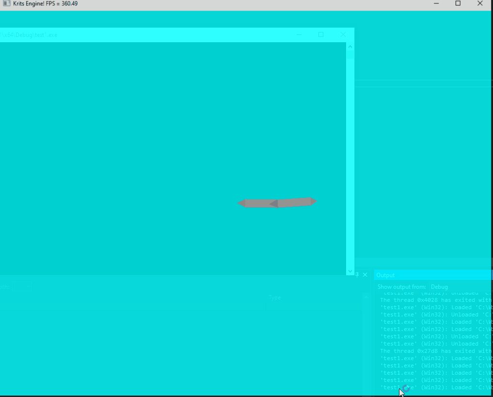

# test1

#General

In this project i made a custom 3D Rendering machine by using the SFML library for 2D graphics.Then i implemented a simulation for 
a planar 2-DOF robot arm and visuallized the simulated arm.

#3D Machine info

This 3D rendering was implemented only for educational and testing puproses and is by no means optimaized. The machine is
only capable of  rendering triangles in different shades of gray.Texturing and more advanced stuffed are not implemented.
This basic functionallity was the the minimum nessecary for visuallizing the robot motion.
The user can control the camera with the by rotating or displacing it using the arrow keys and the QWEASDZX keys.
The functionallity of the rendering machine is implemented in the KritsEngine.cpp file.

Also we need to note that in order to use this code you need to change the settings and include the needed SFML libraries in your VS project.
You can find out how to do that in their tutorials.

#Robot Simultion

In the simulation the equations of motion were derived with the Euler-Newton Method and at each frame the equations are intgrated.
Also in the simulation the user can control the torques applied to each joint and a basic PD controller is implemented in code and sets
the arm in a desired configuration.

